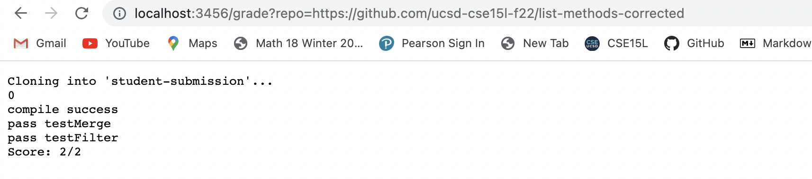
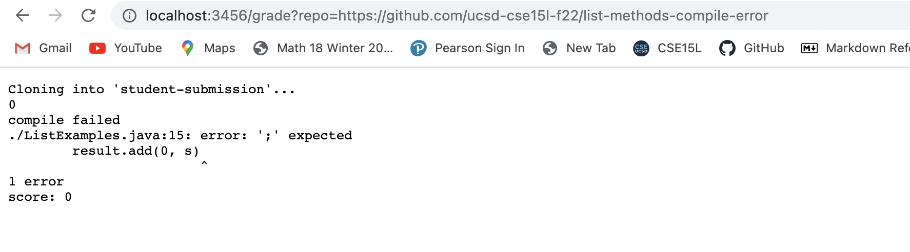
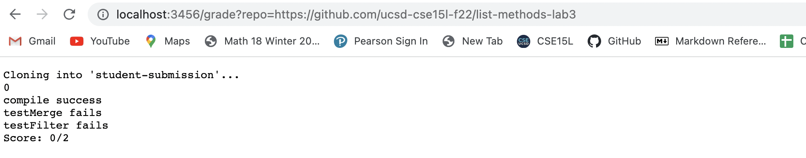
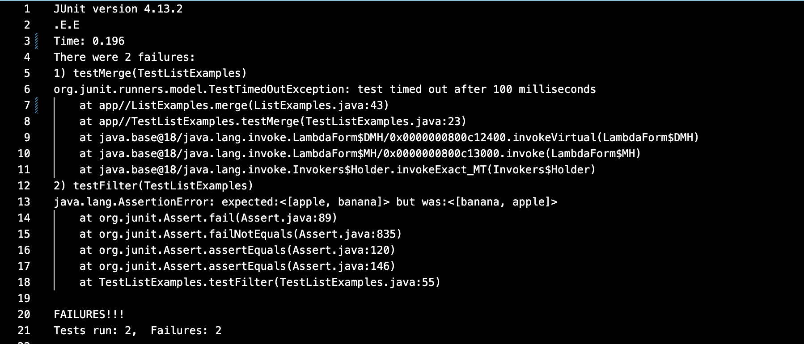

# Lab Report 5
## grade.sh
~~~
{
totalScore=2
CPATH=".:lib/hamcrest-core-1.3.jar:lib/junit-4.13.2.jar:student-submission/"

rm -rf student-submission
git clone $1 student-submission

if [[ -e student-submission/ListExamples.java ]]
then
    echo $?
else
    echo "Can't find your file"
    echo "score: 0"
    exit 1
fi

touch student-submission/ListExamples.java
mv student-submission/ListExamples.java .

javac -cp $CPATH TestListExamples.java 2>compError.txt

if [[ $? -eq 0 ]]
then
    echo "compile success"
else
    echo "compile failed"
    cat compError.txt
    echo "score: 0"
    exit 1
fi 

java -cp $CPATH org.junit.runner.JUnitCore TestListExamples 1>codeError.txt

if [[ $(grep -c "testMerge(TestListExamples)" codeError.txt) -eq 1 ]]
then 
    ((totalScore-=1))
    echo "testMerge fails"
else
    echo "pass testMerge"
fi

if [[ $(grep -c "testFilter(TestListExamples)" codeError.txt) -eq 1 ]]
then 
    ((totalScore-=1))
    echo "testFilter fails"
else
    echo "pass testFilter"
fi

echo Score: $totalScore/2
}
~~~
## Screenshots

This is the screenshot for http://localhost:3456/grade?repo=https://github.com/ucsd-cse15l-f22/list-methods-corrected. It says that the files are compiled successfully and it passes alll the tests and get the full score.

This is the screenshot for http://localhost:3456/grade?repo=https://github.com/ucsd-cse15l-f22/list-methods-compile-error. It says that there is a compiled error and so it gets 0.

This is the screenshot for http://localhost:3456/grade?repo=https://github.com/ucsd-cse15l-f22/list-methods-lab3. It says that there are two test failures leading it to get 0.

## trace
Choose https://github.com/ucsd-cse15l-f22/list-methods-lab3 

For
~~~
totalScore=2
CPATH=".:lib/hamcrest-core-1.3.jar:lib/junit-4.13.2.jar:student-submission/"
~~~
two variables are created. They both have return codes as zero. The standard outputs and the standard errors are empty.

For
~~~
rm -rf student-submission
git clone $1 student-submission
~~~
things stored in https://github.com/ucsd-cse15l-f22/list-methods-lab3 is clone to the local computer. The return code are zeros for both commands here and the standard output is empty for both commands. The standard error is empty for the first command but is "Cloning into 'student-submission'..." for the second one.

For
~~~
if [[ -e student-submission/ListExamples.java ]]
then
    echo $?
else
    echo "Can't find your file"
    echo "score: 0"
    exit 1
fi
~~~
Since there exists a ListExamples.java stores in student-submission, the condition is true. Thus, only runs the then part and won't run else part. The return code of the if statement is 0 and its standard output and error are both empty. The return code for "echo $?" is 0 and its standard error is empty. Its standard output is 0.

For 
~~~
touch student-submission/ListExamples.java
mv student-submission/ListExamples.java .
~~~
ListExamples.java is moved from student-submission to the current directory, which is list-examples-grader where all java files exist. They both have return code of 0. Their standard output and standard error are both empty.

For 
~~~
javac -cp $CPATH TestListExamples.java 2>compError.txt
~~~
Then the TestListExamples.java is compiled. The standard error is redirected to compError.txt (for this one, standard error doesn't give anything and compError.txt is empty). The return code is 0 and the standard output and the standard error are both empty.

For
~~~
if [[ $? -eq 0 ]]
then
    echo "compile success"
else
    echo "compile failed"
    cat compError.txt
    echo "score: 0"
    exit 1
fi 
~~~
Since this compiles success, the return code is 0. Thus, the condition for if is true and it runs the command in then part and won't run the commands in else part. The return codes for both if command and echo command are 0. And the standard output and error for if is empty. The standard output for echo is "compile success" and the standard error is empty.

For 
~~~
java -cp $CPATH org.junit.runner.JUnitCore TestListExamples 1>codeError.txt
~~~
Then runs TestListExamples and stores the standard output, which reports the failures in running two tests, in codeError.txt. The standard output is 

The standard error is empty and the standard return code is 1.

For
~~~
if [[ $(grep -c "testMerge(TestListExamples)" codeError.txt) -eq 1 ]]
then 
    ((totalScore-=1))
    echo "testMerge fails"
else
    echo "pass testMerge"
fi
~~~
Then check if "testMerge(TestListExample)" appears one time in codeError.txt. In this case, since the test fails on testMerge, the string is in codeError.txt and so the condition for this if is true. It has zero return code and empty standard output and error. The then part runs. Thus, totalScore munis one. It has empty standard output and error. The echo "testMerge fails" gives standard output "testMerge fails" and empty standard error. They both have the 0 return codes. The else part won't run.

~~~
if [[ $(grep -c "testFilter(TestListExamples)" codeError.txt) -eq 1 ]]
then 
    ((totalScore-=1))
    echo "testFilter fails"
else
    echo "pass testFilter"
fi
~~~
  This if checks if "testFilter(TestListExamples)" appears one time in codeError.txt. In this case, since the test fails on testFilter, the string appears in codeError.txt as a part of report of failure. The condition is true and so then part runs and else part won't run. The if command has a 0 return code and empty standard output and error. Thus, totalScore minus one. It has empty standard output and error. echo "pass testFilter" gives the standard output "testFilter fails" and empty standard error. They both have the 0 return codes.

For
~~~
echo Score: $totalScore/2
~~~
Since now totalScore is 0, it has standard output "Score: 0/2". It has return code of 0 and empty standard error.